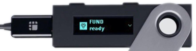
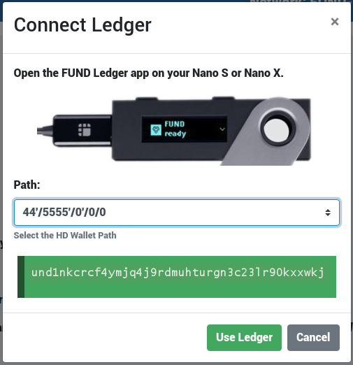
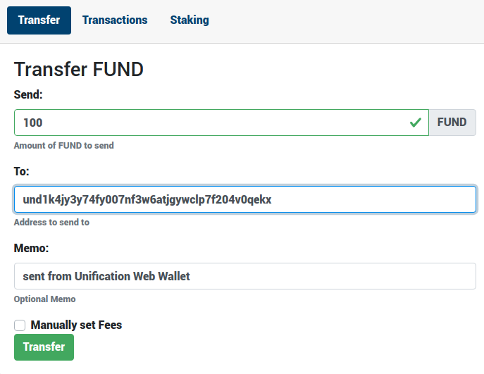
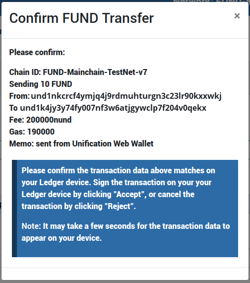
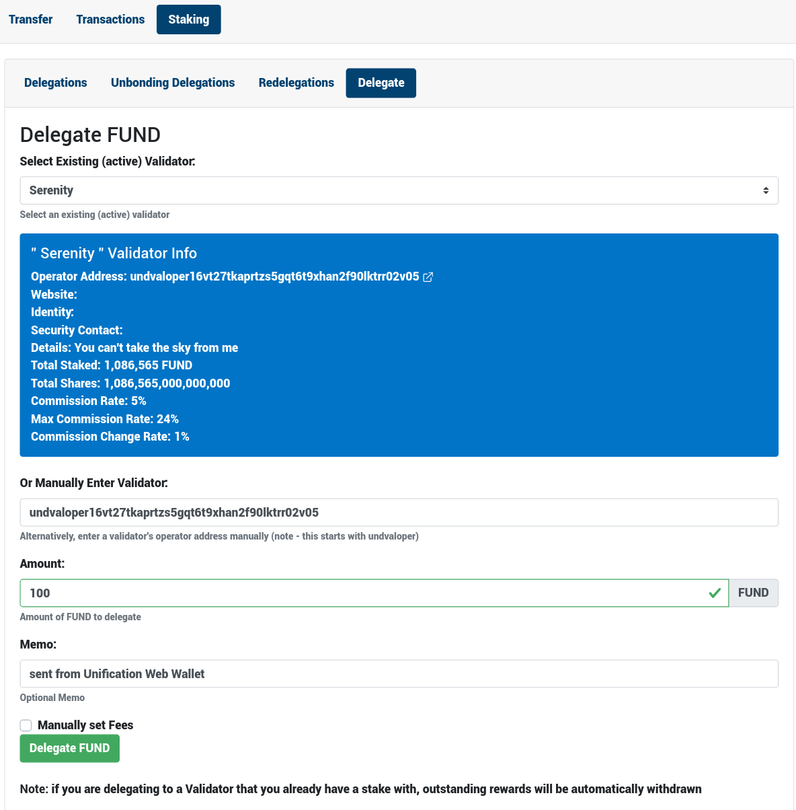

# Using a Ledger Device with Unification's Web Wallet Chrome Extension

Ledger devices are hardware wallets, and considered one of the most secure
methods for storing your private keys for interacting with blockchains.

Unification's **FUND Ledger app** is fully integrated into our **Web Wallet** Chrome extension, allowing you to securely sign all **Web Wallet** transactions on your Ledger device for broadcasting to the Mainchain network.

Unification's **FUND Ledger app** and **Web Wallet** integration is currently supported on Ledger Nano S and Nano X devices.

With the **FUND Ledger app** and **Web Wallet** Chrome Extension, you will be able to:

- Send and receive FUND
- Delegate FUND to Validators
- Undelegate FUND from a Validator you have delegated to
- Redelegate FUND between Validators
- Withdraw any FUND rewards earned from your FUND delegations to Validators

#### Contents

[[toc]]

## Prerequisites

Before going through this guide, please ensure that you have:

1. [Set up](https://support.ledger.com/hc/en-us/articles/360000613793) or [restored](https://support.ledger.com/hc/en-us/articles/360005434914) your Ledger device
2. Have updated your Ledger device's [firmware](https://support.ledgerwallet.com/hc/en-us/articles/360002731113-Update-Ledger-Nano-S-firmware)
3. Have installed the [Ledger Live](https://support.ledger.com/hc/en-us/articles/360006395553) Desktop application on your computer.
4. Are using a browser such as Google Chrome that supports Chrome Extensions.

## Installing the FUND Ledger app

Once you have completed the prerequisites, you will be ready to install the FUND
Ledger app on your Ledger device.

1. Open the **Ledger Live** desktop application
2. Connect your Ledger device to your computer, and unlock it
3. In the Ledger Live desktop application, go to the **Manager**
4. On your device, click "**Allow Ledger Manager**" if prompted
5. Search the app catalogue for "**FUND**"
6. Click "**Install**" next to the app and follow any prompts in the Ledger Live desktop application or on your Device.

Once the FUND app is installed on your device, you're ready to interact with
the **Web Wallet** Chrome Extension.

## Installing the Web Wallet Chrome Extension

1. Go to the official [Unification Web Wallet](https://chrome.google.com/webstore/detail/unification-web-wallet/mkjjflkhdddfjhonakofipfojoepfndk) Chrome extension in the Chrome Store.
2. Click the "Add Extension" button.

This will install the We Wallet Chrome extension in your browser. **Web Wallet >= v0.19.0** supports the **FUND Ledger app**.

## Using the Web Wallet Chrome extension with your Ledger Device

Once everything is installed, open the **Web Wallet** Chrome extension, plug in your Ledger Device with the USB cable, and open the **FUND Ledger app** - you should see **FUND Ready**. 

1. In **Web Wallet**, click on the  button, and select **Connect Ledger Device**
2. You may be prompted by Chrome to allow access to your Ledger Device.

A modal will appear allowing you to select a HD wallet path. Each time you change the selection, **Web Wallet** will query your Ledger device for the corresponding wallet address and display it.

Once you have selected the address you would like to use, click the **Use Ledger** button.

You will then be prompted to check your **Ledger device** to ensure that the wallet address displayed on your device matches the address displayed in **Web Wallet**.

On your Ledger device, use the right button to scroll right, followed by clicking both buttons on **OK** to accept 

The **Web Wallet** will now load your account balance and any staking information, along with your recent transactions (if any) for the selected HD path and wallet address. Your balance is displayed in the **Summary** section at the top of the **Web Wallet**.

## Sending FUND with your Ledger device

1. Click on the **Transfer** tab in **Web Wallet**

2. Enter the amount of **FUND** you would like to send.
3. Enter the wallet address you are sending to
4. Optionally, enter a memo
5. Click the **Transfer** button

At this point, a confirmation dialog will be displayed containing an overview of your transaction details, including the Chain ID, amount you are transferring, to and from addresses, and any fee & gas information. You can click **Cancel** to go back and make changes.

Once you are happy with the details, click the  button.

You will then be prompted to check the transaction details on your Ledger device to ensure they match those displayed in the confirmation dialog in **Web Wallet**. Click the **right** button on your Ledger device to scroll through the details. Once you reach the end, you are given the option to either  or  the transaction.

Clicking **Approve** on your Ledger device will tell the device to sign the transaction and return the signed Tx. **Web Wallet** will receive the signed transaction from the Ledger device and broadcast it to the network.

Clicking **Reject** on your Ledger device will cancel the process - the transaction will **not** be signed by your Ledger, and **Web Wallet** will cancel and clear the transaction details.

## Staking with your Ledger Device

Similar to sending FUND, it is possible to execute Stake transactions in **Web Wallet**, using your Ledger device to sign them.

1. Click the **Staking** tab in **Web Wallet**, followed by the **Delegate** tab.

2. Select the validator from the drop down list that you would like to delegate FUND to
3. Enter the amount of FUND you would like to delegate
4. Optionally enter a memo
5. Click the **Delegate FUND** button

As with the Transfer function, **Web Wallet** will display a dialog with an overview of the transaction your are about to send. You will be prompted to confirm the transaction details on your Ledger device, and given the option to either  or  the transaction.

Clicking **Approve** on your Ledger device will tell the device to sign the transaction and return the signed Tx. **Web Wallet** will receive the signed transaction from the Ledger device and broadcast it to the network.

Clicking **Reject** on your Ledger device will cancel the process - the transaction will **not** be signed by your Ledger, and **Web Wallet** will cancel and clear all of the transaction details.

## Undelegating, Redelegating and Withdrawing FUND Rewards

Undelegating, Redelegating and Withdrawing your FUND rewards works in exactly the same way.

1. Click the **Staking** tab, followed by the **Delegations** tab in **Web Wallet**, and click the **Refresh** button if required.
2. Click the  button next to the Validator you have delegated FUND to. This will display more information, and several options.
3. Click the respective  button to perform the selected transaction.

For each action, you will be asked to enter the relevant information, and, as with Transfer and Staking, you will be prompted to confirm the transaction on your Ledger device before it is signed and broadcast to the network.

## Issues & Support

Both the **FUND Ledger app** and **Web Wallet** are fully open source and available in our GitHub repos. Issues can be raised in the respective repo:

- FUND Ledger App: [https://github.com/unification-com/ledger-unification](https://github.com/unification-com/ledger-unification)
- Web Wallet Chrome Extension: [https://github.com/unification-com/web-wallet](https://github.com/unification-com/web-wallet)

Support is also available via our official [Discord](https://discord.gg/SeB69w5) channels from our fantastic community, and [Telegram](https://t.me/unificationfoundation).
